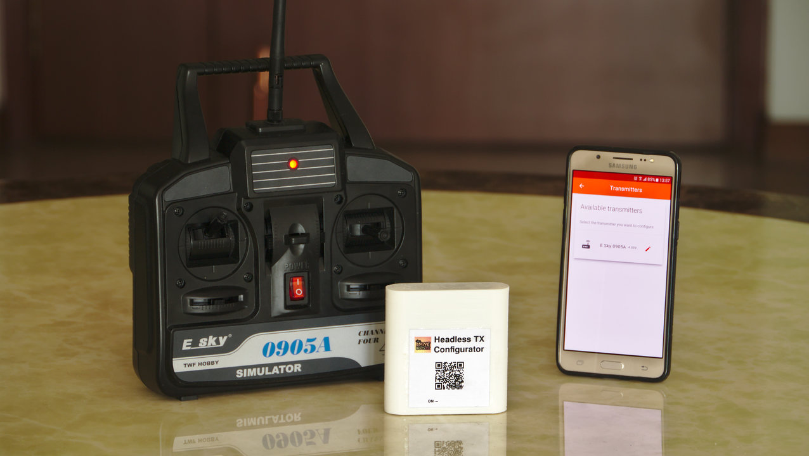

# STM32F103 and NRF24L01+ based headless transmitter

This project implements a 2.4 GHz RC transmitter using the NRF24L01+ wireless module and the STM32F103C8T6 micro-controller.

The term *headless* comes from the IT industry, where a headless system is one that does not provide a user interface itself, but is rather configured remotely. Within this project, *headless* means that the transmitter does not have a display or buttons for configuration. It relies on remote configuration through a web-browser running on a Smartphone, Tablet or computer.

The motivation for this project was to upgrade old AM/FM RC transmitter hardware, and to turn a cheap RC simulator into a fully operational transmitter that supports multiple models.

By keeping the user interface for configuration out of the transmitter, we don't need to perform complicated mechanical modifications to add a display and buttons. We only replace the old electronics with a modern 32 bit ARM micro-controller and a reliable 2.4 GHz transceiver wired on a prototyping board.

The transmitter is currently compatible with HobbyKing HKR3000 and HKR3100 receivers, as well as the [LANE Boys RC nrf24le01-rc](https://github.com/laneboysrc/nrf24l01-rc) DIY receivers. It runs off a 1S Li-Ion battery.

## How it works

The *headless transmitter* works like any low-end 2.4 GHz RC system on the market: power it on, and use it with the model you have it setup for.

However, unlike low-end transmitters, the *headless transmitter* supports advanced features like expo, mixing, failsafe and more.

In order to configure those features, you need to use a web-browser on your Smartphone, Tablet or computer.

To be able to connect your Smartphone to the transmitter, we need to translate between different radio protocols: The transmitter uses a proprietary RF protocol, while the Smartphone supports Wi-Fi. This translation takes place in a small, external box called *configurator*.

When you want to configure your *headless transmitter*, you turn the *configurator* on, connect your phone to the Wi-Fi accesspoint the *configurator* provides, and lanch the configuration web-app to perform the configuration. When you are done, the changes are automatically saved in the transmitter and persist over power cycles.

The Smartphone also has a large amount of persistent memory. This allows us to store configurations for multiple models. When we want to reconfigure the transmitter for another model, we simply download the model configuration configuration into the *headless transmitter*. This only takes a few seconds.

The power consumption of the transmitter is low: A single 800 mAh Li-Ion battery keeps the transmitter running for approximately 15 hours.

## Cost

When sourcing the modules from China, a transmitter can be modified for less than USD 10. The *configurator* hardware cost is less than USD 15. You only need one *configurator*, regardless of how many *headless transmitters* you have.

## Getting started

Please consult the [INSTALL.md](INSTALL.md) file for instructions of how to set up your development environment.

The [doc/](doc) folder contains various documents explaing details for the architecture.

You can find schematics for the *headless transmitters* hardware in the [electronics/transmitter/](electronics/transmitter) folder. Likewise, the *configurator* schematics are in [electronics/esp8266-nrf51-configurato/r](electronics/esp8266-nrf51-configurator). Bill of Material (BOM) files are included.

The *headless transmitters* firmware resides in the [firmware](firmware) directory.

The *configurator* has two micro-contollers, hence two firmwares. The nRF51822 firmware is in [configurator/nrf51-nrf-uart-bridge/](configurator/nrf51-nrf-uart-bridge), the ESP8266 firmware in [configurator/esp8266-uart-websocket-bridge/](configurator/esp8266-uart-websocket-bridge).
The web-app that provides the actual user interface (HTML, CSS and JavaScript) is stored in [configurator/web-app/](configurator/web-app). It gets stored as SPIFFS image on the ESP8266.

## WORK IN PROGRESS

This project is not finished yet. Refer to the [TODO](TODO.md) list for items that we plan to implement in the future.

